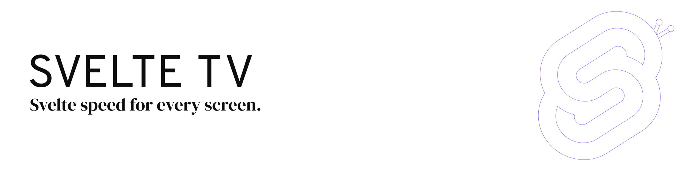

<a href="https://rasterzero-dev.github.io/svelte-tv-docs/">
	<picture>
		<source media="(prefers-color-scheme: dark)" srcset="banner_dark.png">
		
	</picture>
</a>

<h1 align="center">
  <a href="https://rasterzero-dev.github.io/svelte-tv-docs//">
    Svelte TV
  </a>
</h1>

  <strong>Svelte speed for every screen:</strong> 
  Build high-performance TV interfaces with Lightning.

  
  
  

<h3 align="center">
  <a href="https://rasterzero-dev.github.io/svelte-tv-docs/docs/getting-started/">Getting Started</a>
   &middot; 
  <a href="https://rasterzero-dev.github.io/svelte-tv-docs/docs/essentials/focus/">Learn the Basics</a>
   &middot; 
  <a href="https://sveltetv.dev/docs/contributing">Contribute</a>
</h3>

Svelte TV brings [**Svelte**'s][s] component model to [**Lightning**][l]-powered living room apps. With Svelte TV, you build renderer-native, focus-driven interfaces for Canvas and WebGL.

- **Declarative.** Build TV screens with Svelte components while rendering through Lightning.
- **Remote-first.** Directional focus, key handling, hold states, and focus styling are part of the core.
- **Renderer-native.** Use Canvas or WebGL without relying on DOM layout.
- **Practical.** Routing, transitions, effects, virtual lists, and SDF font tooling are included.

[s]: https://svelte.dev/
[l]: https://github.com/lightning-js/renderer

## Contents

- [Requirements](#requirements)
- [Building your first Svelte TV app](#building-your-first-svelte-tv-app)
- [Documentation](#documentation)
- [Roadmap](#roadmap)
- [How to Contribute](#how-to-contribute)
- [License](#license)

## 📋 Requirements

Svelte TV targets Svelte 5 and `@lightningjs/renderer` 3.x. For supported renderer modes, font setup, and project requirements, see the [Requirements guide][requirements].

Because Svelte 5 relies on [JavaScript Proxy](https://developer.mozilla.org/en-US/docs/Web/JavaScript/Reference/Global_Objects/Proxy) for its reactivity model, Svelte TV requires Chrome 49 or newer.

## 🎉 Building your first Svelte TV app

Follow the [Getting Started guide][getting-started] to create your first Svelte TV app. If you are new to focus-driven TV interfaces, start with [Learn the Basics][learn].

## 📖 Documentation

The full documentation for Svelte TV can be found on our [website][docs].

The documentation covers renderer setup, focus handling, layout, routing, effects, primitives, fonts, and deployment notes.

## 🚀 Roadmap

Svelte TV is evolving around real TV app needs. You can follow planned work, open design notes, and release direction in the [Roadmap][roadmap].

## 👏 How to Contribute

We want contributing to Svelte TV to be focused and practical. Read the [Contributing Guide][contribute] to learn how to report issues, propose changes, and work on the project.

## 📄 License

Svelte TV is Apache-2.0 licensed, as found in the [LICENSE][license] file.

[requirements]: https://rasterzero-dev.github.io/svelte-tv-docs/docs/requirements
[getting-started]: https://rasterzero-dev.github.io/svelte-tv-docs/docs/getting-started/
[docs]: https://rasterzero-dev.github.io/svelte-tv-docs/docs
[roadmap]: https://sveltetv.dev/roadmap
[contribute]: https://sveltetv.dev/docs/contributing
[license]: ./LICENSE
